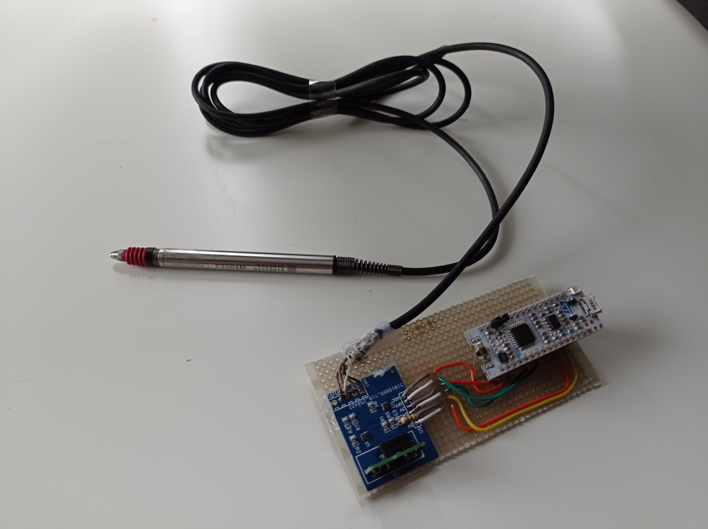
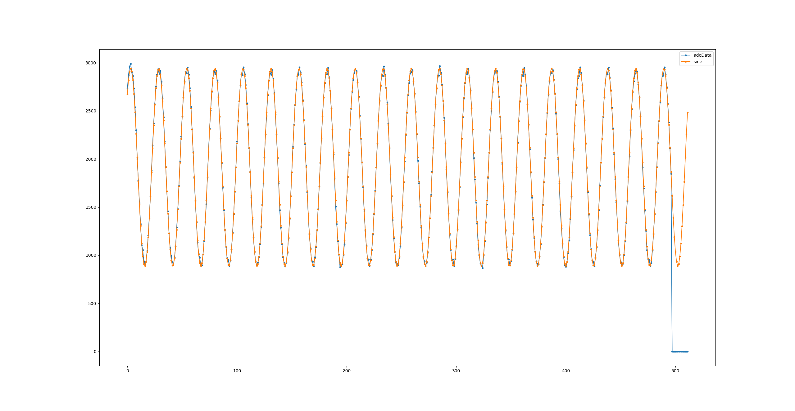
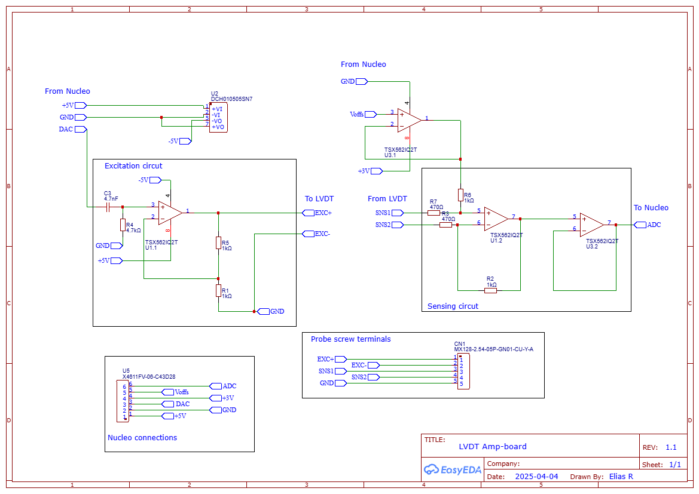
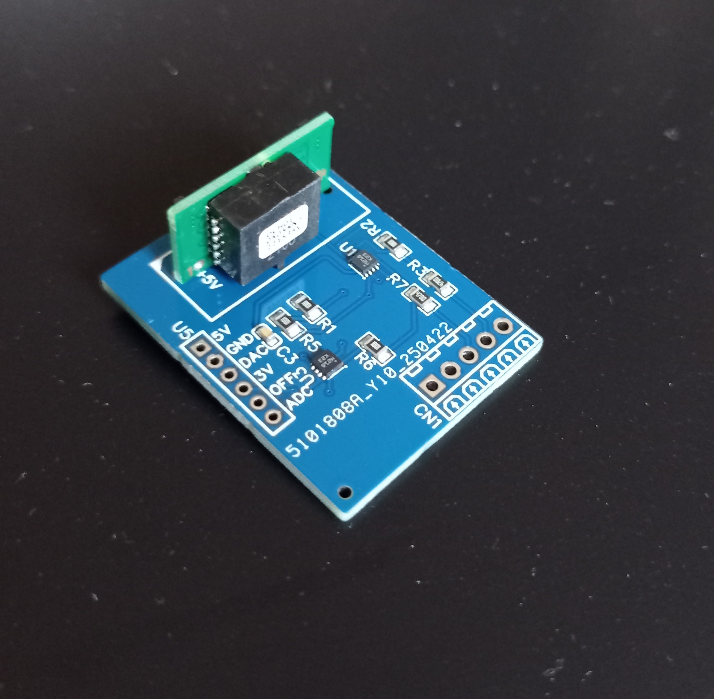

# Measurement indicator measurement unit

This repo contains the code for a Nucleo STM32F303K8 and a pc client to utilize a LVDT test indicator.

Releated blog post: [eliasrhoden.github.io](https://eliasrhoden.github.io/embedded/2025/06/15/Measurement-Test-indicator.html)

Typical high precision digital test indicators use a Linear Varaible Differential Transformer (LVDT), used by for example Mahr, Tesa, etc. In this project a Mahr P2004M was used.

More info regarding the principle of LVDT can be found on [wikipedia](https://en.wikipedia.org/wiki/Linear_variable_differential_transformer) but also this site [rdp-group](https://www.rdpe.com/ex/hiw-lvdt.htm) has a really nice animation of the working principle.

The general principle is that we generate a sinusoidal exciting voltage that we feed the measurement probe, and the resulting sense voltage is also a sine wave, where the amplitude is related to the distance moved by the probe.

The firmware in *LvdtMeas* generates the excitation voltage on one of its DAC's and samples the resulting sine wave and fits a sine wave to the sensed signal using leas squares.

The sampled sine wave and least square wave is plotted by the client, and the measurment value printed to the console.

For the Nucleo code, STM32CubeIDE v1.18.1 was used.

## Hardware

Appart from the Nucleo a custom PCB was designed in order to amplify the outgoing and incoming signals to the measurement probe.

